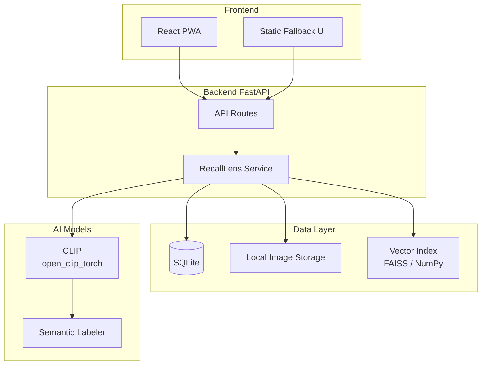
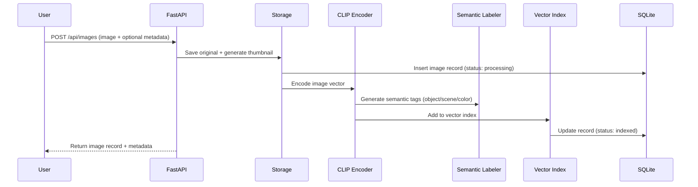
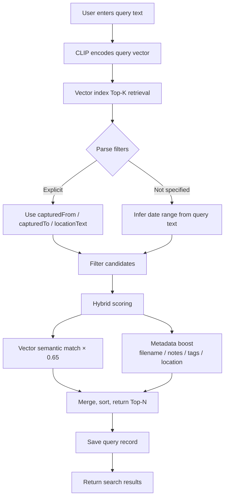

[中文](README.md)

# RecallLens

**Local-first visual memory index for everyday objects** — Upload a photo, search later with natural language to quickly find your things.

Supports queries like "where are my keys?", "blue backpack", or "passport drawer" in both English and Chinese.

## Highlights

- **Local CLIP semantic retrieval** — Automatic vector embeddings for images with natural language search, no cloud API required
- **Zero-shot semantic tags** — Automatically identifies object type, scene, and color, saved into each image description
- **Hybrid ranking** — Vector semantic matching + weighted boosts from filenames, notes, tags, and location text
- **Smart date inference** — Automatically infers date ranges from query text (today, yesterday, this week, last N days)
- **PWA offline support** — React frontend + static fallback UI, both installable as PWAs

## Architecture



## Quick Start

```bash
# Install dependencies (including CLIP)
uv sync --extra test
uv pip install -r requirements-clip.txt

# Start backend
uv run uvicorn backend.app.main:app --reload --port 8000
```

Open `http://localhost:8000/app/` to get started.

Quick start without CLIP:

```bash
RECALLLENS_EMBEDDER=hash uv run uvicorn backend.app.main:app --reload --port 8000
```

## Upload Flow



## Search Flow



## Tech Stack

| Layer | Technology |
|-------|-----------|
| Frontend | React, Vite, TypeScript, PWA |
| Backend | FastAPI, SQLite, local image storage |
| Retrieval | Local CLIP embeddings, FAISS optional |
| Image Understanding | CLIP zero-shot semantic tags |
| Test/Demo | Deterministic hash embeddings (dev & test only) |

## Project Structure

```
backend/
  app/          FastAPI application
  tests/        Backend API and retrieval tests
frontend/
  src/          React PWA source
  public/       manifest, icon, service worker
static/         No-build fallback PWA served at /app/
data/           Local runtime data, ignored by git
```

## API Endpoints

| Method | Path | Description |
|--------|------|-------------|
| `POST` | `/api/images` | Upload image (multipart or JSON base64) |
| `GET` | `/api/images` | List images by newest first |
| `GET` | `/api/images/{id}` | Get single image record |
| `POST` | `/api/search` | Natural language search |
| `GET` | `/api/queries` | Search history |
| `GET` | `/api/tags` | Semantic tag groups |
| `GET` | `/api/health` | Service status |

## Configuration

| Environment Variable | Default | Description |
|---------------------|---------|-------------|
| `RECALLLENS_DATA_DIR` | `./data` | Data storage directory |
| `RECALLLENS_EMBEDDER` | `clip` | Embedding backend (`clip` or `hash`) |
| `RECALLLENS_CLIP_MODEL` | `ViT-B-32` | CLIP model name |
| `RECALLLENS_CLIP_PRETRAINED` | `laion2b_s34b_b79k` | CLIP pretrained weights |

## Frontend Setup

```bash
cd frontend
npm install
npm run dev
```

Open `http://localhost:5173`. Defaults to API at `http://localhost:8000`:

```bash
VITE_API_BASE_URL=http://localhost:8000 npm run dev
```

## Demo Dataset

Try the full upload/index/search flow without CLIP weights:

```bash
RECALLLENS_EMBEDDER=hash uv run python scripts/seed_demo.py --data-dir data/demo
RECALLLENS_EMBEDDER=hash RECALLLENS_DATA_DIR=data/demo uv run uvicorn backend.app.main:app --reload --port 8000
```

Try searching: `keys entry shelf`, `blue backpack`, `passport drawer`, `charger nightstand`

## Tests

```bash
uv sync --extra test
RECALLLENS_EMBEDDER=hash uv run pytest
```

Quick smoke tests:

```bash
RECALLLENS_EMBEDDER=hash uv run python scripts/smoke_backend.py
RECALLLENS_EMBEDDER=hash uv run python scripts/smoke_api.py
```
