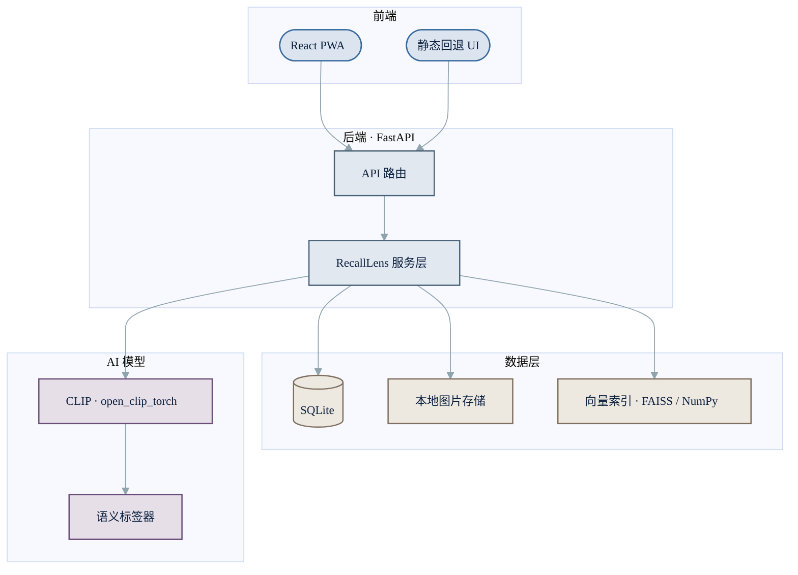
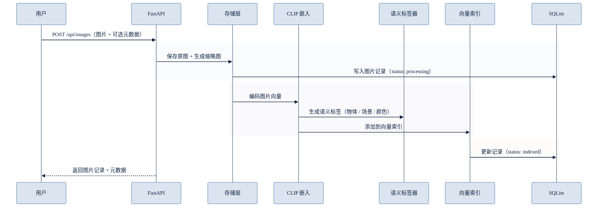

[English](README.en.md)

# RecallLens

**本地优先的日常物品视觉记忆索引** — 拍照上传，用自然语言搜索，快速找回物品。

支持「我的钥匙在哪？」「蓝色背包」「护照 抽屉」等中英文查询。

## 功能亮点

- **本地 CLIP 语义检索** — 图片自动生成向量嵌入，支持自然语言搜索，无需云端 API
- **零样本语义标签** — 自动识别物体类型、场景、颜色，写入每张图片描述
- **混合排序** — 向量语义匹配 + 文件名/笔记/标签/位置文本加权，让个人提示词更有效
- **智能日期推断** — 从查询文本自动推断日期范围（今天、昨天、本周、最近 N 天）
- **PWA 离线可用** — React 前端 + 静态回退界面，均可安装为 PWA

## 系统架构



## 快速开始

```bash
# 安装依赖（含 CLIP）
uv sync --extra test
uv pip install -r requirements-clip.txt

# 启动后端
uv run uvicorn backend.app.main:app --reload --port 8000
```

打开 `http://localhost:8000/app/` 即可使用。

无需 CLIP 的快速体验：

```bash
RECALLLENS_EMBEDDER=hash uv run uvicorn backend.app.main:app --reload --port 8000
```

## 上传流程



## 搜索流程

```mermaid
%%{init:{"theme":"base","themeVariables":{"primaryTextColor":"#0a1f3d","lineColor":"#7a8f9e","fontFamily":"system-ui,sans-serif","fontSize":"13px"}}}%%
flowchart LR
    classDef input fill:#dce5ef,stroke:#3a6b9f,stroke-width:1.4px,color:#0a1f3d
    classDef process fill:#e2e8f0,stroke:#4a6278,stroke-width:1.4px,color:#0a1f3d
    classDef decision fill:#f5f0eb,stroke:#7d6e5d,stroke-width:1.4px,color:#0a1f3d
    classDef score fill:#e6dfe8,stroke:#6b4d7a,stroke-width:1.4px,color:#0a1f3d
    classDef result fill:#dce5ef,stroke:#3a6b9f,stroke-width:1.4px,color:#0a1f3d

    A["查询文本"]:::input --> B["CLIP 编码向量"]:::process
    B --> C["向量索引 Top-K"]:::process
    C --> D{"解析过滤条件"}:::decision
    D -->|"显式指定"| E["capturedFrom / To<br/>locationText"]:::process
    D -->|"未指定"| F["推断日期范围"]:::process
    E --> G["候选集筛选"]:::process
    F --> G
    G --> H["混合评分"]:::score
    H --> I["向量匹配 × 0.65"]:::score
    H --> J["元数据加分"]:::score
    I --> K["合并排序 Top-N"]:::result
    J --> K
    K --> L["保存查询记录"]:::result
    L --> M["返回搜索结果"]:::result
```



## 技术栈

| 层级 | 技术 |
|------|------|
| 前端 | React, Vite, TypeScript, PWA |
| 后端 | FastAPI, SQLite, 本地图片存储 |
| 检索 | 本地 CLIP 嵌入，FAISS 可选加速 |
| 图像理解 | CLIP 零样本语义标签 |
| 测试/演示 | 确定性哈希嵌入（仅开发和测试） |

## 项目结构

```
backend/
  app/          FastAPI 应用
  tests/        后端 API 与检索测试
frontend/
  src/          React PWA 源码
  public/       manifest、图标、Service Worker
static/         无构建回退 PWA，通过 /app/ 访问
data/           本地运行时数据，不纳入版本控制
```

## API 端点

| 方法 | 路径 | 说明 |
|------|------|------|
| `POST` | `/api/images` | 上传图片（multipart 或 JSON base64） |
| `GET` | `/api/images` | 按时间倒序列出图片 |
| `GET` | `/api/images/{id}` | 获取单张图片记录 |
| `POST` | `/api/search` | 自然语言搜索 |
| `GET` | `/api/queries` | 搜索历史 |
| `GET` | `/api/tags` | 语义标签分组 |
| `GET` | `/api/health` | 服务状态 |

## 配置项

| 环境变量 | 默认值 | 说明 |
|----------|--------|------|
| `RECALLLENS_DATA_DIR` | `./data` | 数据存储目录 |
| `RECALLLENS_EMBEDDER` | `clip` | 嵌入后端（`clip` 或 `hash`） |
| `RECALLLENS_CLIP_MODEL` | `ViT-B-32` | CLIP 模型名称 |
| `RECALLLENS_CLIP_PRETRAINED` | `laion2b_s34b_b79k` | CLIP 预训练权重 |

## 前端启动

```bash
cd frontend
npm install
npm run dev
```

打开 `http://localhost:5173`，默认连接 `http://localhost:8000`：

```bash
VITE_API_BASE_URL=http://localhost:8000 npm run dev
```

## 演示数据

无需 CLIP 权重即可体验完整流程：

```bash
RECALLLENS_EMBEDDER=hash uv run python scripts/seed_demo.py --data-dir data/demo
RECALLLENS_EMBEDDER=hash RECALLLENS_DATA_DIR=data/demo uv run uvicorn backend.app.main:app --reload --port 8000
```

尝试搜索：`钥匙 玄关 架子`、`蓝色 背包`、`护照 抽屉`、`充电器 床头`

## 测试

```bash
uv sync --extra test
RECALLLENS_EMBEDDER=hash uv run pytest
```

快速冒烟测试：

```bash
RECALLLENS_EMBEDDER=hash uv run python scripts/smoke_backend.py
RECALLLENS_EMBEDDER=hash uv run python scripts/smoke_api.py
```
